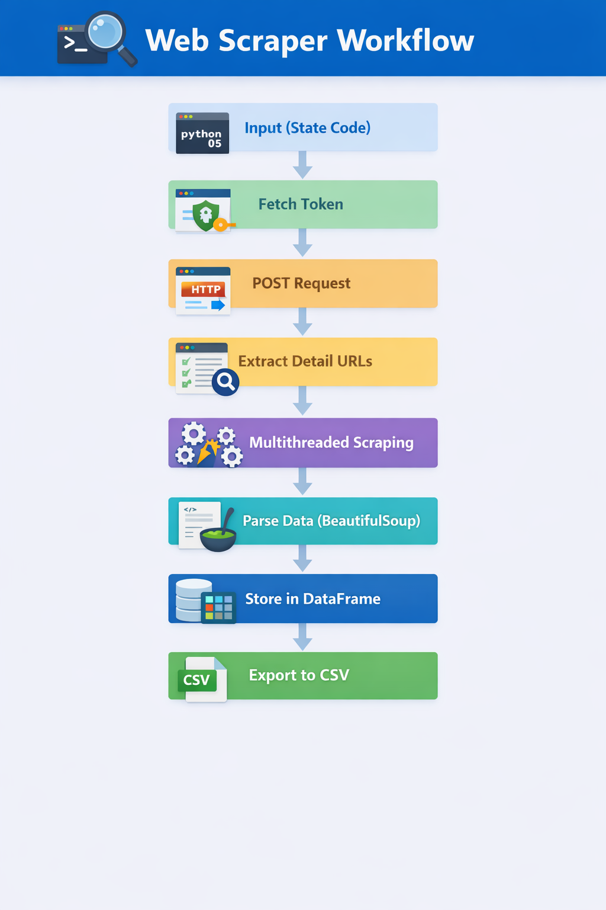
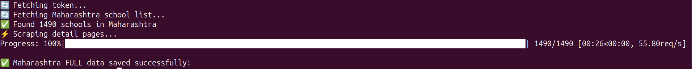

# 🏫 CBSE School Scraper


---

## 🔥 Key Highlights

* Scraped **1490+ schools** in a single run
* Achieved **~55 requests/sec** using multithreading
* Real-time progress tracking using `tqdm`
* Fully containerized using Docker

---

## 📊 Workflow

![Workflow]
<p align="center">
  
</p>
---

## ⚡ Sample Output



---

## 🎯 Why This Project?

This project demonstrates:

* Web scraping automation
* Multi-threaded data processing
* CLI-based execution
* Containerization using Docker
* Volume mounting for persistent storage
* Clean project structuring
* DevOps workflow (Git + Docker)

---

## 🚀 What This Project Does

The CBSE SARAS portal provides school affiliation data via a web interface.

This project automates:

* Form submission
* CSRF token handling
* School list extraction
* Detail page crawling
* Multi-threaded scraping
* Structured CSV export

---

## ✨ Features

* ✅ State-wise school data extraction
* ✅ Automatic CSRF token handling
* ✅ Multi-threaded detail page scraping
* ✅ High-speed performance
* ✅ Structured CSV output
* ✅ Docker support
* ✅ Scalable for all Indian states

---

## 💡 Use Cases

* Data pipeline ingestion
* Educational analytics
* Automation workflows
* DevOps scheduled jobs (cron + Docker)

---

## 🛠 Tech Stack

* Python 3.12
* requests
* beautifulsoup4
* pandas
* concurrent.futures (ThreadPoolExecutor)
* Docker

---

## 📂 Project Structure

```
cbse-school-scraper/
│
├── scraper.py
├── requirements.txt
├── Dockerfile
├── .dockerignore
├── README.md
├── .gitignore
├── assets/
│   ├── flowchart.png
│   └── output.png
└── output/
```

---

## ⚙️ Installation

```bash
git clone https://github.com/vaibxcodes/cbse-school-scraper.git
cd cbse-school-scraper
python3 -m venv venv
source venv/bin/activate
pip install -r requirements.txt
```

---

## ▶️ Usage

```bash
python scraper.py <STATE_CODE>
```

### Example:

```bash
python scraper.py 17  # Maharashtra
```

---

## 🐳 Docker Usage

```bash
docker build -t cbse-scraper .
docker run -v $(pwd)/output:/app/output cbse-scraper 17
```

---

## 📥 Output

```
output/state_<STATE_CODE>_school_details.csv
```

Contains:

* School Name
* Affiliation Number
* Address
* District
* Website
* Principal Name
* And more

---

## 🎬 Demo

```bash
Fetching token...
Fetching Maharashtra school list...
Found 1490 schools
Scraping detail pages...

Progress: 100% | 1490/1490 [00:26, ~55 req/s]

✅ Data saved successfully!
```

---

## ⚠️ Disclaimer

This project is intended for:

* Educational purposes
* Automation learning
* Research use

Please avoid excessive requests to prevent server overload.

---

## 👨‍💻 Author

**Vaibhav Patil**
DevOps & Automation Enthusiast 🚀

---

## 🌟 Future Improvements

* PostgreSQL integration
* Logging & retry system
* CLI using argparse
* Full India automation mode
* REST API wrapper
* CI/CD pipeline
* Scheduled execution (cron + Docker)
